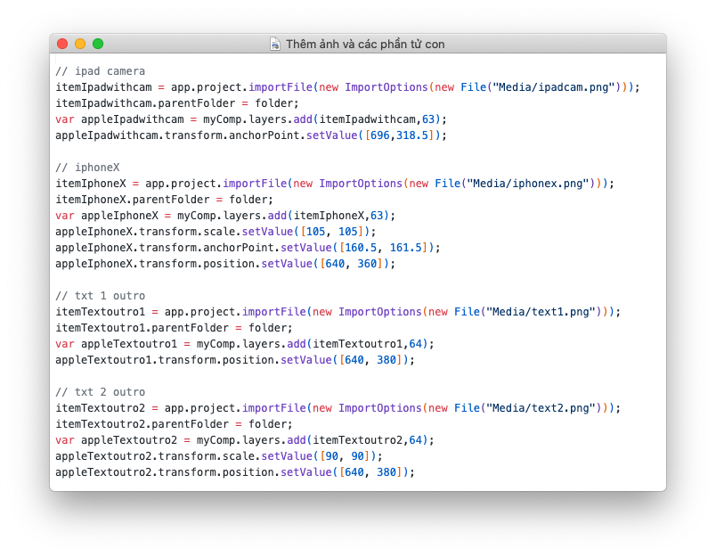
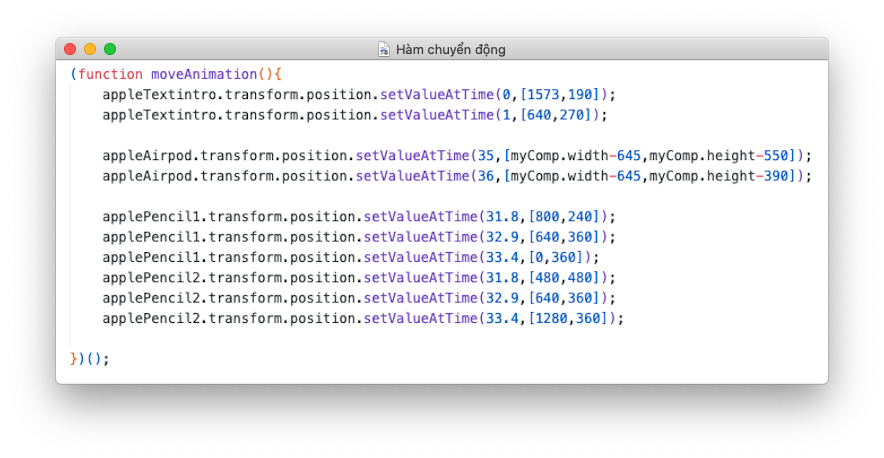

# Báo cáo Lập trình kỹ xảo

# I. Xây dựng kịch bản

### **1. Yêu cầu**

Viết scrip thực hiện các nội dung:

- Có giao diện điều khiển cho người dùng
- Có nút chức năng tạo project và lưu project, tạo comp với tên nhập vào
- Tạo các loại layer theo kịch bản đã xây dựng
- Có nút hiển thị hướng dẫn các bước cho người dùng
- Có nút chức năng Render đề xuất sản phẩm

Yêu cầu:

- Có ít nhất 2 layer gồm text, shape hoặc nhiều hơn
- Nội dung text: TênSV–MãSV
- Kỹ xảo: Có ít nhất 1 kỹ xảo chuyển động: thay đổi kích thước, màu sắc, ẩn hiện
    
    hoặc kết hợp theo kịch bản đã xây dựng
    
- Giao diện panel điều khiển rõ ràng, trình bày đẹp
- Thông tin hướng dẫn đầy đủ, rõ ràng từng bước
- Định dạng xuất file theo tiêu chuẩn H.264
- Nộp bài đầy đủ file code, sản phẩm đã render, file kịch bản và nén lại
- Sản phẩm chạy trên window và không bị lỗi trước khi nộp

### **2. Ý tưởng**

TVC ngắn quảng cáo, nhận diện thương hiệu - ở đây là công ty Apple và các sản phẩm cốt lõi của họ

### **3.Kịch bản**

| Cảnh  | Giây | Nội Dung |
| --- | --- | --- |
| Mở đầu | 0-2 | Đưa ra đoạn text nổi bật đi kèm đó là sản phẩm nổi bật nhất của công ty  |
| Chính | 2-57 | Lần lượt đưa ra các biểu tượng, sản phẩm của công ty dưới dạng tối giản nhưng vẫn giữ nét đặc trưng → Người dùng vẫn nhận da sản phẩm đó |
| Kết thúc | 57-66 | Đưa ra câu mang giá trị của công ty + Logo Công ty |

# II. Xây dựng Script

### **1.  Khởi tạo Project và Comp chính**

```jsx
app.project.close(CloseOptions.DO_NOT_SAVE_CHANGES);
// app.newPoject();

// create comp
var myComp = app.project.items.addComp("Main Comp",1280,720,1,66,30);
```

Ở đây tên Comp được đặt là `Main Comp` với định dạng thuộc tính : 

- Kích thước 1280x720 (ngang x cao)
- Tỉ lệ biến dạng hình khối 1:1
- Số khung hình/s: 30 Frame/s
- Độ dài Comp: 66s

Ngoài Comp chính tự Generate ngay khi người dùng khởi chạy Script ra thì người dùng có thể tạo Comp cho riêng mình khi cửa sổ người dùng hiện ra theo trình tự từng bước trên giao diện người dùng (Có ấn nút “ hướng dẫn ” để biết thêm thông tin nếu chưa hiểu)

### **2. Tạo background bằng solid layer**

```jsx
// ==== Solid Background ====
var solidLayer2 = myComp.layers.addSolid([222/255,222/255,222/255], "Background2", 1280, 720, 1, myComp.duration);
var solidLayer1 = myComp.layers.addSolid([255/255,255/255,255/255], "Background1", 1280, 720, 1, myComp.duration);
```

### **3. Tạo âm thanh nền**

```jsx
// var audioLayer = myComp.selectedLayers[0];
itemSoundtrack = app.project.importFile(new ImportOptions(new File("Media/Soundtrack.mp3")));
itemSoundtrack.parentFolder = folder;
var logoT = myComp.layers.add(itemSoundtrack);
```

### **4. Tạo Layer Text**

```jsx
// Khởi tạo Layer text
var myTextLayer=myComp.layers.addText();
	var myPropertyText=myTextLayer.property('Source Text');
	var myTextValue=myPropertyText.value;
	
// Thuộc tính cho màu sắc chữ và viền chữ
	myTextValue.text=myText.text;
	myTextValue.fontSize=70;
	myTextValue.fillColor=[1,1,1];
	myTextValue.applyFill=true;
	myTextValue.strokeColor=[1,1,1];
	myTextValue.applyStroke=true;

	myPropertyText.setValue(myTextValue);
	myPropertyText.setValue(myTextValue);
	
	// Xác định độ trong cho chữ
	var myOpacity=myTextLayer.property('Opacity');

	myOpacity.setValueAtTime(0,0);
	myOpacity.setValueAtTime(2,100);
	myOpacity.setValueAtTime(10,0);
	var myPosition=myTextLayer.property('Position');
	myPosition.setValueAtTime(2,[myComp.width/4,myComp.height/4]);
```

### **5. Tạo Layer Shape**

```jsx
var remoteLayer=myComp.layers.addShape();
       remoteLayer.name="remote1";       
        
var buttonContent = remoteLayer.property("ADBE Root Vectors Group");
var circleGroup=buttonContent.addProperty("ADBE Vector Group");
// Duoi phai
var circle = circleGroup.property("ADBE Vectors Group").addProperty("ADBE Vector Shape - Ellipse");
	circleGroup.transform.scale.setValue([147,147]);
	circle.property("ADBE Vector Ellipse Position").setValueAtTime(41.12,[65,300]);
	circle.property("ADBE Vector Ellipse Position").setValueAtTime(41.75,[65,148]);
	circle.property("ADBE Vector Ellipse Position").setValueAtTime(43,[65,150]);
	circle.property("ADBE Vector Ellipse Position").setValueAtTime(44.1,[-63,-140]);
	circle.property("ADBE Vector Ellipse Size").setValueAtTime(43.6,[100,100]);
	circle.property("ADBE Vector Ellipse Size").setValueAtTime(44.2,[90,90]);
```

### **5. Thêm các hình ảnh, assets**

Ở đây để tiện quản lý, các ảnh và asset thêm vào (đọc từ Folder “Media” - cùng cấp thư mục với file `Script`) được nhóm vào  folder “Assets” trên After Effect 

```jsx
// Import file media
var folder = app.project.items.addFolder("Assets");
```



### **6. Thêm các chuyển động, hoạt cảnh cho các đối tượng, layer**

Các hàm được set cho tập các đối tượng sử dụng cùng phương thức. Các giá trị của từng đối tượng trong từng hàm được đặt giá trị thay đổi theo thời gian → Tạo chuyển động




### 7.  **Khoá các Layer tránh thay đổi không đáng muốn trong quá trình dùng**


# III. Sản phẩm

### **1. File  mã nguồn**

Giải nén file, file script `run.jsx` dùng để chạy. Các file hình ảnh, âm thanh … thành phần được đặt trong Folder `Assets` và chung cấp thư mục với file `run.jsx`

### **2. Hình ảnh Menu chọn và Project**


### **3. Hình ảnh sản phẩm**


Mac Pro


Apple Pencil


Homepod Speaker


iMac Retro


