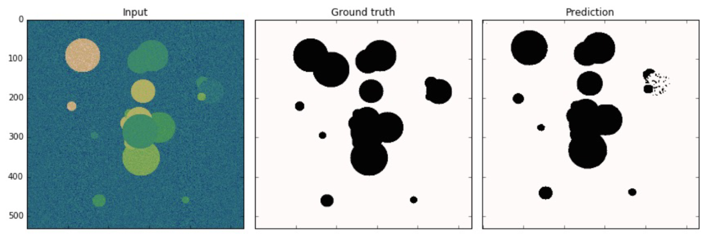
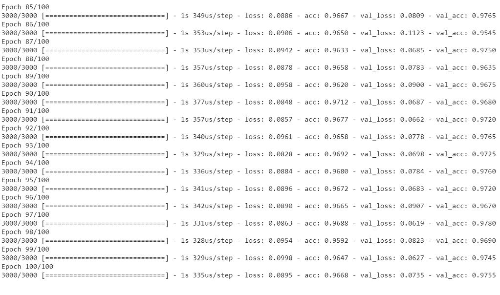

# Nghiên cứu phân vùng ảnh trong không gian sử dụng mạng giải chập với phương pháp Unet và Pixel-based

# I. Mở đầu

## **1. Tổng Quan**


Trong Computer Vision nói riêng và xử lý ảnh nói chung chúng ta thường đề cập đến 2 bài toán là **Image Classification** và **Image Detection**. Ở Bài tập lớn, nhóm đã hướng tới giải quyết bài toán nhận diện hình ảnh (**Image Detection**) trong việc phát hiện người ngủ gật khi lái xe. Bài tập cuối kỳ nhóm tiến tới giải quyết vấn đề thứ 3 trong lĩnh vực này **Image Segmentation**.


Đối với bài toán classification thì chúng ta quan tâm đến sự xuất hiện của các vật thể trong hình ảnh. Đối với bài toán detection chúng ta xác định vị trí của đối tượng trong hình ảnh sau đó vẽ 1 boundary box xung quanh đối tượng. Còn đối với bài toán **Image segmentation** hàm ý rằng bài toán sẽ phân chia một hình ảnh thành nhiều vùng ảnh khác nhau. Image Segmentation cũng có chung mục tiêu như object detection là phát hiện ra vùng ảnh chứa vật thể và gán nhãn phù hợp cho chúng. Tuy nhiên tiêu chuẩn về độ chính xác của Image Segmentation ở mức cao hơn so với Object Detection khi nó yêu cầu nhãn dự báo đúng tới từng pixel. 

## 2. Hướng phát triển

### **2.1. Dữ liệu**

Image Segmentation nếu được huấn luyện theo bài toán học có giám sát trong thị giác máy tính thì sẽ yêu cầu gán nhãn cho ảnh. Input của bài toán là một bức ảnh và output là một ma trận mask mà giá trị của từng pixel đã được gãn nhãn trên đó.

Các bài toán trong **image segmentation** lại chia thành các bài toán nhỏ hơn 

- Semantic segmentation: Chúng ta phân đoạn (segment) các vùng ảnh theo những nhãn khác nhau mà không phân biệt sự khác nhau giữa các đối tượng trong từng nhãn. Ví dụ trong hình ảnh bên trái chúng ta phân biệt được pixel nào thuộc về người và pixel nào thuộc về background. Tuy nhiên trong bức ảnh xuất hiện 5 người, mức độ phân chia sẽ không xác định từng pixel thuộc về người nào.
- Instance segmentation: Chúng ta phân đoạn các vùng ảnh chi tiết đến từng đối tượng trong mỗi nhãn. Ví dụ: ở hình ảnh bên phải đối với nhãn người sẽ được phân chia chi tiết tới từng người 1, 2, … , 5.


### **2.2. Mạng giải chập** (**Deconvolutional Neural Network**)

Khác với mạng CNN được dùng ở bài toán nhận dạng người ngủ gật nhóm đã làm ở bài trước, đối với bài toán **Image** **segmentation** chúng ta dùng mạng **giải chập (Deconvolutional Neural Network) với hai thành phần chính là *encoder*** và ***decoder*** 

Với các mạng CNN thông thường sẽ có kích thước giảm dần qua các layers để cuối cùng chúng ta thu được những đặc trưng bậc cao (high-level). Chức năng chính của CNN là chuyển từ ảnh sang đặc trưng. Vậy nếu muốn chuyển từ đặc trưng sang ảnh chúng ta sẽ cần thực hiện như thế nào?

Mạng giải chập sẽ giúp chúng ta thực hiện điều đó. Một mạng giải chập sẽ có kiến trúc chung là shape của các layers tăng dần. Qua từng layer mạng sẽ giải mã các khối đặc trưng thành những thông tin không gian của từng điểm ảnh và tạo thành một bức ảnh mới ở output.

Quá trình gia tăng kích thước tại các layers của mạng giải chập còn được gọi là Upsampling. Trong các bài toán classification và object detection dường như là chúng ta không sử dụng mạng giải chập bởi output của những bài toán này là xác định nhãn hoặc vị trí. Thế nhưng đối với các bài toán Image2Image (đầu vào là ảnh và trả ra output cũng là ảnh), chúng ta thường xuyên bắt gặp mạng giải chập và các layer có tác dụng Upsampling như `Transposed Convolution, Dilation Convolution, Upsampling 2D`.


Trong đó phần ***encoder*** dùng để giảm chiều dài và chiều rộng của ảnh bằng việc sử dụng các lớp convolutions và các lớp poolings. Trong đó phần ***decoder*** dùng để phục hồi lại kích thước ban đầu của ảnh. Phần ***encoder*** thường chỉ là một mạng CNN thông thường nhưng bỏ đi những layer fully conected cuối cùng. Chúng ta có thể sử dụng những mạng có sẵn trong phần encoder như *VGG16, VGG19, Alexnet,*... Còn decoder tùy vào các kiến trúc mạng mà ta có thể xây dựng khác nhau. Ví dụ trong mạng FCN.


Trong kiến trúc FCN, có 3 cách để xây dựng phần decoder tạo thành 3 loại FCN khác nhau là FCN32, FCN16, FCN8. Đối với FCN32, sau khi đến lớp pooling cuối cùng (trong ví dụ trên là lớp pooling thứ 5) ta chỉ cần upsample về kích thước ban đầu. Đối với FCN16 thì tại lớp pooling thứ 5 ta nhân 2 lần để được kích thước bằng với kích thước của lớp pooling thứ 4, sau đó add 2 lớp vào với nhau rồi upsample lên bằng với kích thước ảnh ban đầu. Tương tự với FCN8 ta kết nối tới lớp pooling thứ 3.

Một số kiến trúc điển hình trong xử lý bài toán loại này 

**1. Mask RCNN**

Mask RCNN là sự kết hợp giữa Faster RCNN và Fully Connected Network (FCN):


**2. Deep Lab**

Deep lab v3 sử dụng cấu trúc Encoder-Decoder (nhìn hình):


**3. U-net**

Là một trong các kiến trúc được phát triển trên mạng giải chập đưa ra một kết quả chính xác và khả năng xử lý mạnh mẽ, tên gọi của mạng cũng vì kiến trúc hình chữ U của nó 

Có thể thấy, trong phần decoder ngoài việc upsample ta còn thực hiện kết nối đối xứng với các layer phần encoder cho đến tận layer cuối cùng. Rõ ràng nếu như ta upsample ngay từ layer cuối cùng ở phần encoder thì thông tin của bức ảnh ban đầu bị mất đi rất nhiều. Do đó việc ta kết nối đối xứng với phần encoder sẽ giúp ta phục hồi lại thông tin đã mất tại các lớp pooling. Bây giờ mình sẽ code để xây dựng một mạng Unet đơn giản.


Điểm đặc biệt giúp U-net khác với các kiến trúc khác

- **Thứ nhất**, toàn bộ kiến trúc không hề sử dụng một lớp fully connected nào. thay vì dùng các mô hình ent-to-end thông thường khi làm việc với bài toán Deep Learning , lớp kế cuối của mạng sẽ là các lớp fully connected để kết nối các đặc trưng đã phân tích được nhằm đưa ra kết quả dự đoán. Tuy nhiên, ở kiến trúc U-net, việc kết nối các đặc trưng sẽ do nửa thứ 2 của "chữ U" đảm nhận, điều này giúp mạng không cần mạng fully connected, do đó có thể chấp nhận input với kích thước bất kì
- **Thứ hai**: U-net sử dụng Phương pháp đệm (Padding method), điều này giúp kiến trúc có thể phân đoạn hình ảnh được hoàn toàn. Phương pháp này đặc biệt quan trọng khi segment cho các hình ảnh, nếu không, độ phân giải có thể bị hạn chế bởi dung lượng của bộ nhớ GPU.
- **Thứ 3:** Ngoài việc Decoder như thông thường thì nó còn lấy Value tương ứng của lớp Encoder bên kia đưa sang. Bởi như các Model thông thường sau khi Encoder thông thường (thu nhỏ kích thước) thì mất đi mối tương quan về vị trí trên ảnh. Unet giải quyết vấn đề đó và mang lại thêm thông tin về cái model đó

# II. Xây dựng hệ thống

## **Bài Toán 1:**

### **Đặt vấn đề**

Người dùng cần xây dựng một chương trình tự động phát hiện lỗi trong sản phẩm

### **Hướng xử lý & dữ liệu**

Với một số bài xử lý lỗi bản thân chỉ dùng Open CV cũng được, tuy nhiên với một số bài toán với số lượng sản phẩm nhiều và đa dạng thì giải pháp tối ưu là dùng **Unet Segmentation.**


Quá trình xử lý bài toán với đầu vào và đầu ra dự định đạt được biểu thị qua hình sau



Vùng đen là vùng có lỗi và vùng trắng là vùng thường

Dữ liệu đầu vào bao gồm có 

6000 ảnh sản phẩm kích thước 512 x 512 và chia làm 6 class (1000 tấm mỗi Folder)

Tương ứng với các Folder Class thì có Folder Class lỗi 

Mẫu ảnh sản phẩm lỗi và không lỗi


Sản phẩm có lỗi và đã được tô bằng đường đỏ


Sản phẩm không có lỗi gì 

Ngoài việc xác định sản phẩm có lỗi hay không (Detection) trong bài toán này ta cần chỉ ra dự đoán vị trí lỗi trên sản phẩm 

### **Xử lý dữ liệu**

Như đã đề cập sơ qua ở trên trong việc làm quen và xây dựng kiến trúc mạng Unet, để thực hiện Decoder và Encoder, chúng ta có thể dùng các mạng trích chọn đặc trưng khác nhau của Unet: Resnet, VGG, DenseNet, IncecptionNet....

**IoU Metric** 

Để đo lường độ chính xác, model có tốt hay không ta dùng IoU Như hình IoU càng lớn (chính xác càng cao) khi diện tích vùng chung nhau giữa thực tế và dự đoán là lớn nhất và Tổng diện tính 2 vùng trừ đi vùng trùng là bé nhất


**Tiền xử lý**

- Cài đặt thư viện segmentation_models
- Thư viện Unet (sử dụng luôn mà không Build từ đầu)
- Gán nhãn (sản phẩm nào lỗi ở vị trí nào)
- Thư viện Keras

---

**Tạo Map cho các ảnh sản phẩm không bị lỗi** 

1. Lặp qua Folder không bị lỗi 
2. Tạo ra Folder mask tương ứng
3. Lặp qua các File trong Folder hiện tại 
4. Đọc File và lấy kích thước
5. Tạo File ảnh chỉ màu đen 
6. Lưu file vào thư mục mask

**Tạo Map cho các ảnh sản phẩm bị lỗi (tương tự như sản phẩm lỗi )**

1. Lặp qua Folder bị lỗi 
2. Tạo ra Folder mask tương ứng
3. Lặp qua các File trong Class4_def
4. Tạo ra một ảnh màu đen toàn bộ 
5. Vẽ phần lỗi trên ảnh màu đen 
6. Lưu vào dile 

Phần thông số (ảnh dạng elip) để có thể vẽ được lưu trong file `labels.txt`


Có thông tin về ảnh lỗi, vẽ mask cho vị trí lỗi đó ta truyền vào hàm draw_defect

### **Xây dựng mô hình**

Sau khi ta vẽ mask cho ảnh lỗi và không lỗi trong 2 class ta tiến tới xây dựng model cho việc train dữ liệu 

```python
from sklearn.model_selection import train_test_split
import os
import random

import tensorflow as tf
import cv2
import numpy as np

# Import thu vien segmentation_models
from segmentation_models.metrics import iou_score
from segmentation_models import Unet
import segmentation_models as sm
sm.set_framework("tf.keras")
sm.framework()
```

Trong việc dự đoán, do trong thực tế số lượng sản phẩm lỗi luôn ít hơn khá nhiều trong tổng các sản phẩm (ví dụ 6000 sản phẩm thường chỉ có khoảng 8-900 sản phẩm lỗi), chúng ta xử lý chọn tập mẫu cho 2 tập sản phẩm thường và lỗi như sau

```python
idx = random.sample(range(len(normal_mask_path)), len(defect_mask_path))

    normal_mask_path_new = []
    normal_image_path_new = []

    for id in idx:
        normal_image_path_new.append(normal_image_path[id])
        normal_mask_path_new.append(normal_mask_path[id])

    image_path = normal_image_path_new + defect_image_path
    mask_path = normal_mask_path_new + defect_mask_path

    return image_path, mask_path
```

```python
opt=tf.keras.optimizers.Adam(0.001)
model= Unet(BACKBONE,encoder_weights="imagenet",classes=1,activation="sigmoid",input_shape=(512,512,3),encoder_freeze=True)
loss1 = sm.losses.categorical_focal_dice_loss
model.compile(optimizer=opt,loss=loss1,metrics=[iou_score])

# Train model
is_train = False
if is_train:
    from keras.callbacks import ModelCheckpoint
    filepath="checkpoint.hdf5"
    callback = ModelCheckpoint(filepath, monitor='val_iou_score', verbose=1, save_best_only=True,mode='max')

    model.fit_generator( train_loader, validation_data=test_loader, epochs=50, callbacks=[callback])
else:
    # Load model de test
    model.load_weights("checkpoint.hdf5")

    ids = range(len(image_test))
    index = random.sample(ids, 10)

    import matplotlib.pyplot as plt

    for id in index:

        # Anh dau vao, ko phai mask
        image = cv2.imread(image_test[id])
        image = cv2.resize(image, (512, 512))
        # Dua qua model de predicted segmentation map

        mask_predict = model.predict(image[np.newaxis, :, :, :])

        # Doc mask thuc te
        image_mask = cv2.imread(mask_test[id], cv2.IMREAD_UNCHANGED)
        image_mask = cv2.resize(image_mask, (512, 512))
```

Bên cạnh việc sử dụng thư viện có sẵn, ta cũng có thể tự build model Unet từ đầu như sau

```python
inputs = Input((img_rows, img_cols,1))
    inputs_norm = Lambda(lambda x: x/127.5 - 1.)
    conv1 = Conv2D(8, (3, 3), activation='relu', padding='same')(inputs)
    conv1 = Conv2D(8, (3, 3), activation='relu', padding='same')(conv1)
    pool1 = MaxPooling2D(pool_size=(2, 2))(conv1)

    conv2 = Conv2D(16, (3, 3), activation='relu', padding='same')(pool1)
    conv2 = Conv2D(16, (3, 3), activation='relu', padding='same')(conv2)
    pool2 = MaxPooling2D(pool_size=(2, 2))(conv2)

    conv3 = Conv2D(32, (3, 3), activation='relu', padding='same')(pool2)
    conv3 = Conv2D(32, (3, 3), activation='relu', padding='same')(conv3)
    pool3 = MaxPooling2D(pool_size=(2, 2))(conv3)

    conv4 = Conv2D(64, (3, 3), activation='relu', padding='same')(pool3)
    conv4 = Conv2D(64, (3, 3), activation='relu', padding='same')(conv4)
    pool4 = MaxPooling2D(pool_size=(2, 2))(conv4)

    conv5 = Conv2D(128, (3, 3), activation='relu', padding='same')(pool4)
    conv5 = Conv2D(128, (3, 3), activation='relu', padding='same')(conv5)

    up6 = concatenate([Conv2DTranspose(64, kernel_size=(2, 2), strides=(2, 2), padding='same')(conv5), conv4], axis=3)
    conv6 = Conv2D(64, (3, 3), activation='relu', padding='same')(up6)
    conv6 = Conv2D(64, (3, 3), activation='relu', padding='same')(conv6)

    up7 = concatenate([Conv2DTranspose(32, kernel_size=(2, 2), strides=(2, 2), padding='same')(conv6), conv3], axis=3)
    conv7 = Conv2D(32, (3, 3), activation='relu', padding='same')(up7)
    conv7 = Conv2D(32, (3, 3), activation='relu', padding='same')(conv7)

    up8 = concatenate([Conv2DTranspose(16, kernel_size=(2, 2), strides=(2, 2), padding='same')(conv7), conv2], axis=3)
    conv8 = Conv2D(16, (3, 3), activation='relu', padding='same')(up8)
    conv8 = Conv2D(16, (3, 3), activation='relu', padding='same')(conv8)

    up9 = concatenate([Conv2DTranspose(8, kernel_size=(2, 2), strides=(2, 2), padding='same')(conv8), conv1], axis=3)
    conv9 = Conv2D(8, (3, 3), activation='relu', padding='same')(up9)
    conv9 = Conv2D(8, (3, 3), activation='relu', padding='same')(conv9)

    conv10 = Conv2D(1, (1, 1), activation='sigmoid')(conv9)

    model = Model(inputs=inputs, outputs=conv10)
```

### Kết quả và đánh giá

- Nhận diện được khá tốt ảnh không lỗi và lỗi (kèm vị trí của vùng lỗi)
- Xử lý được lượng lớn các sản phẩm lỗi có cấu tạo hình dáng khác nhau

```python
        plt.figure(figsize=(10, 6))
        plt.subplot(131)
        plt.title("Hình ảnh sản phẩm")
        plt.imshow(image)
        plt.subplot(132)
        plt.title("Vết lỗi thật")
        plt.imshow(image_mask)
        plt.subplot(133)
        plt.title("Vết lỗi dự đoán")
        z = mask_predict[0]#[:, :, 0]
        plt.imshow(z)
        plt.show()
```


## Bài Toán 2:

### **Đặt vấn đề**

Giả sử khách hàng có 1 ảnh vệ tinh và 1 shape file chứa thông tin đo đạc ở 1 số vùng nhất định trên ảnh vệ tinh đó . Khách hàng muốn dựa vào thông tin đo đạc từ 1 phần nhỏ các khu vực đó, tiến hành dự đoán thông tin của toàn bộ ảnh vệ tinh (ở đây là dự đoán khu vực nào là đồng ruộng)


Ảnh vệ tinh về một vùng đất bất kỳ


Ảnh sau khi dán Mask cho vùng được cho là Đồng ruộng hay Nền

### **Hướng xử lý dữ liệu**

Có hai hướng xử lý, một là sử dụng mạng U-net như bài toán nhận diện lỗi sản phẩm ở trên. Hai là xử lý theo hướng pixel-based

```python
import rasterio
import rasterio.features
import rasterio.warp
```

Trong việc sử lý ảnh có thông tin và dữ liệu dạng địa lý, chúng ta sử dụng thư viện Rasterio nhằm đọc và ghi các dữ liệu loại đó và trả về thông tin vị trí và các đặc tính dưới dạng Json


### Tiền xử lý dữ liệu

Từ shapefile và hình ảnh vệ tinh, xác định điểm dữ liệu 

⇒ **Tạo thành 1 file csv chứa 4787 điểm dữ liệu (pixel) đã được gán nhãn (paddy hoặc background)**


Giống ý tưởng của bài toán nhận diện sản phẩm lỗi và vị trí lỗi của nó, kiểu mẫu cho việc gán Mask cho ảnh như sau 

### Xây dựng mô hình


Loss function : Binary Cross-Entropy
Vì bài toán là phân loại cho mỗi pixel nên loss function sẽ là tổng cross-entropy loss cho mỗi pixel trong toàn bộ bức ảnh.
Optimal : Adam

**Tạo điểm dữ liệu**

Từ lớp Mask biển thị cho vùng không có cỏ và có cỏ ở trên ta đọc file ảnh và lưu các thông số của các điểm vị trí trên vào file `input_model.csv`

```python
mask = mask.flatten().reshape(-1,1)
print(len(mask))

Img_pixels = []
with rasterio.open("Input/img.tif") as src:
  Img_pixels.append(src.read())

Img_pixels = np.array(Img_pixels)
print(Img_pixels)

Img_pixels = np.reshape(Img_pixels,(4,height,width))
print(Img_pixels.shape)
print(Img_pixels[0].shape)

pixel_bancolor = [Img_pixels[i].flatten() for i in range(4)]
pixel_bancolor = np.array(pixel_bancolor).T
print(pixel_bancolor)

pixel_color_padding=np.hstack((pixel_bancolor,mask))
print(pixel_color_padding)

labled_pixels = [pixel_color_padding[i,:] for i in range(mask.shape[0]) if(mask[i] > 0)]
labled_pixels = np.array(labled_pixels)
print(labled_pixels)

df = pd.DataFrame(labled_pixels, columns = ['ban1', 'ban2', 'ban3', 'ban4', 'padding'])
print(df.shape)
df.to_csv('Input/input_model.csv')
```

**Xây dựng model**

Ở đây khác với hướng giải quyết trong bài toán sử dụng Unet, nhóm tiến tới việc tác dụng và xử lý tới thông số điểm ảnh trên ảnh đầu vào 

```python
model = Sequential()
model.add(Dense(32, input_shape=(4,)))
model.add(Dense(64,activation='relu'))
model.add(BatchNormalization())
model.add(Dense(64,activation='relu'))
model.add(BatchNormalization())
model.add(Dense(2,activation='sigmoid'))

model.compile(Adam(lr=1e-4,decay=1e-7),'binary_crossentropy', ['accuracy'])
model.summary()
```

### **Kết quả đánh giá**

Sau 100 epochs :
Tập train đạt accuracy : 96.68% và loss là 0.0895
Tập validation đạt accuracy : 97.55% và loss là 0.0735

Kết quả trên tập test : accuracy đạt 98.09% và loss là 0.057

→ Khi chạy model cho ra kết quả xử lý rất nhanh và kết qủa đưa ra cũng khá chính xác so với kỳ vọng 




Xử lí các điểm dữ liệu có thể là lỗi, hoặc dự đoán sai, lệch khỏi cụm

### Cải tiến, hậu xử lý

```python
f = cv2.cvtColor(a, cv2.COLOR_BGR2GRAY)

kernel = cv2.getStructuringElement(cv2.MORPH_CROSS,(5,5))
kernel2 = cv2.getStructuringElement(cv2.MORPH_ELLIPSE,(5,5))
kernel3 = cv2.getStructuringElement(cv2.MORPH_RECT,(5,5))

closing = cv2.morphologyEx(f, cv2.MORPH_CLOSE, kernel3)
for i in range(5):
    closing = cv2.morphologyEx(closing, cv2.MORPH_CLOSE, kernel2)
opening = cv2.morphologyEx(closing, cv2.MORPH_OPEN, kernel2)
del closing
for i in range(5):
    opening = cv2.morphologyEx(opening, cv2.MORPH_OPEN, kernel2)
input_img = cv2.morphologyEx(opening, cv2.MORPH_OPEN, kernel3)

plt.imshow(input_img)
# print(input_img)
# print(a.shape)
```

# III. Kết quả, thảo luận và đề xuất

So sánh UNet, ENet, and BoxENet và đưa ra tính hiệu quả và khách quan

# IV. Tài liệu tham khảo

1. [Research on the pixel-based and object-oriented methods of
urban feature extraction with GF-2 remote-sensing images](https://arxiv.org/pdf/1903.03412.pdf)
2. [Pixel-Based Machine Learning in Medical Imaging](https://www.researchgate.net/publication/223963336_Pixel-Based_Machine_Learning_in_Medical_Imaging)
3. [Deep Learning Segmentation and Classification for Urban Village Using a Worldview Satellite Image Based on U-Net](https://www.researchgate.net/publication/341407425_Deep_Learning_Segmentation_and_Classification_for_Urban_Village_Using_a_Worldview_Satellite_Image_Based_on_U-Net)